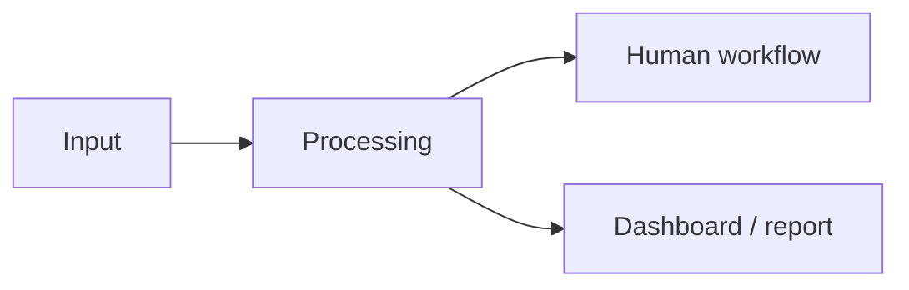

# Case Title

## One-liner

Short public description of the business problem and the system built.

## Context

What kind of business, team or workflow this case is about.

## Problem

What was slow, invisible, manual, risky or hard to scale.

## Solution

What was designed or implemented, and why this approach made sense.

## Architecture

## Stack

- Tool or platform 1;
- Tool or platform 2;
- Database or data layer;
- Automation layer;
- AI or analysis layer.

## Results

- metrics to collect.
- metrics to collect.
- Qualitative result, if safe to share.

## Lessons Learned

- What worked.
- What did not work.
- What I would improve next.

## Public Guardrails

- What was anonymized.
- What was intentionally omitted.
- What evidence can be shared safely.
