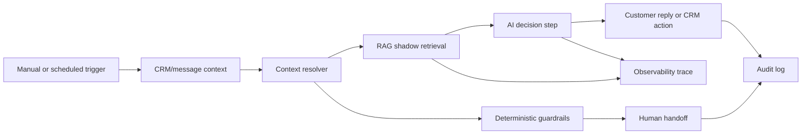

# AI Customer Operations Agent Workflow Sample

## One-liner

I prepared a public-safe workflow sample that shows how an AI customer operations agent can combine CRM context, retrieval, deterministic guardrails, observability and human review.

## Context

Many customer operations workflows are not pure chatbots. They need to read business context, decide whether automation is safe, route risky cases and leave an audit trail.

The goal of this sample is to make that architecture visible without exposing any private workflow, customer data, credentials or internal URLs.

## Problem

A useful AI customer operations agent needs more than a model call:

- triggers for manual tests and scheduled runs;
- CRM and message context normalization;
- retrieval or shadow retrieval for approved knowledge;
- deterministic rules for high-risk cases;
- budget and cost controls;
- human handoff when automation should not act;
- audit logging for decisions, messages, movement and review.

Without those layers, the workflow may look impressive in a demo but stay hard to trust in production.

## Solution

The public-safe sample documents the shape of an AI customer operations workflow without including private implementation details.

The workflow pattern includes:

- manual test cases for regression checks;
- scheduled candidate lookup for operational processing;
- schema/bootstrap step for decision and trace tables;
- context normalization before AI generation;
- commercial/context resolver before model usage;
- RAG-style shadow retrieval to evaluate context quality;
- deterministic handoff paths for complaints, high value or reply limits;
- AI decision step only when automation is allowed;
- customer message assembly as a controlled action;
- CRM note/movement creation with audit logging;
- observability traces for retrieval, decision and handoff.

## Architecture

## Stack

- n8n-style workflow orchestration;
- CRM and messaging context;
- Postgres decision and audit tables;
- pgvector-style retrieval path;
- LLM decision step with structured output;
- observability traces;
- human-in-the-loop handoff.

## What This Demonstrates

- AI workflow architecture for real customer operations.
- Separation between context resolution, retrieval, generation and action.
- Guardrails before automation acts.
- Observability and audit logging as part of the product surface.
- Public proof without leaking production details.

## Results

- Workflow nodes documented in the public-safe sample: metrics to collect.
- Regression cases covered: metrics to collect.
- Deterministic handoff rules validated: metrics to collect.
- Retrieval shadow events reviewed: metrics to collect.
- Human review outcomes captured: metrics to collect.

## Lessons Learned

- A trustworthy AI ops agent is a workflow, not a prompt.
- RAG can be introduced in shadow mode before it becomes customer-facing.
- Human handoff is not failure; it is a safety path.
- Observability should log retrieval, decision, action and review together.
- Public case studies should show architecture and tradeoffs without exposing private operations.

## Public Guardrails

- No private business names, workflow IDs, credentials, webhook paths or internal URLs.
- No real customer messages, phone numbers, order IDs or CRM records.
- No production screenshots with sensitive data.
- Keep unvalidated numbers as `metrics to collect`.

