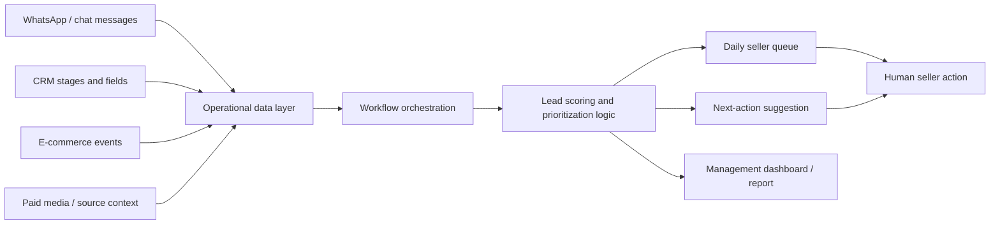

# AI Lead Intelligence for Chat Commerce

## One-liner

I designed an AI-assisted lead prioritization and follow-up system for a premium personalized e-commerce operation with high-volume chat-based sales.

## Context

A personalized e-commerce business was receiving opportunities through WhatsApp, paid traffic, CRM workflows and e-commerce events.

The sales team had useful commercial context, but that context was distributed across tools, conversations, stages and follow-up routines.

## Problem

The operational challenge was not simply answering faster. Sellers needed to know:

- which conversations deserved attention first;
- what business context mattered;
- whether the lead had urgency, value or buying intent;
- what next action could move the opportunity forward;
- which opportunities were at risk of being forgotten.

Without structured prioritization, good opportunities can become invisible inside normal chat volume.

## Solution

I mapped the commercial workflow and designed a prioritization layer that combines CRM, chat and commerce signals into a daily seller queue.

The system direction includes:

- consolidating lead, CRM and message context;
- classifying urgency and commercial intent;
- scoring leads by stage, recency, action status and potential value;
- generating a daily seller priority queue;
- suggesting the next best action or follow-up angle;
- exposing operational visibility through reports or dashboards;
- keeping humans in the loop before sensitive commercial action.

## Architecture

## Stack

- CRM and sales pipeline data;
- WhatsApp/chat sales context;
- workflow automation with n8n and Make;
- e-commerce/order context;
- paid media/source context;
- Postgres or operational database layer;
- LLM-assisted classification and summarization;
- dashboard or daily reporting layer.

## What This Demonstrates

- AI workflow design for a real business process.
- CRM and revenue operations thinking.
- Human-in-the-loop automation.
- Integration between sales, e-commerce, messaging and data.
- Ability to translate business ambiguity into an operating system.

## Results

- Monthly lead/message volume: metrics to collect.
- Number of active workflows: metrics to collect.
- Response-time or follow-up SLA improvement: metrics to collect.
- Leads recovered or reactivated: metrics to collect.
- Manual hours saved: metrics to collect.
- Sellers/users impacted: metrics to collect.
- Revenue influenced by recovery or follow-up, if safe to disclose: metrics to collect.

## Public Guardrails

- No customer names, phone numbers, order IDs or internal URLs.
- No exact private revenue numbers unless explicitly approved.
- Screenshots must be anonymized.
- Exact business names can be removed if the public version needs to stay generic.
