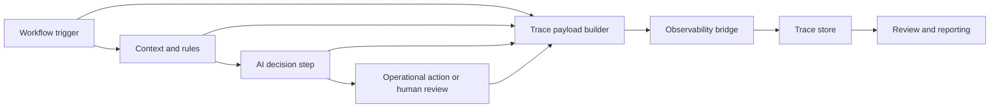

# AI Workflow Observability Contract

## One-liner

I am standardizing how AI-assisted workflows log context, decisions, risk, cost and human review so automation can be inspected before it is trusted.

## Context

As more operational workflows start using LLMs, the hardest failures are usually not syntax errors.

They are audit failures:

- nobody can explain why the workflow suggested an action;
- cost is invisible until usage spikes;
- handoffs happen without a clean reason trail;
- human edits never return to the quality loop;
- the review surface is split across logs, chat tools and workflow history.

## Problem

An AI workflow that touches CRM, chat or operational routing should not be treated like a black box.

Without a shared trace contract, each workflow logs different fields, leaves out risk signals and makes later evaluation much harder.

## Solution

Define a small observability contract that every AI-assisted workflow must emit, regardless of whether it runs in n8n, a local agent wrapper or a lightweight operator panel.

Public-safe source materials behind this case:

- a shared observability contract for trace fields and safety rules;
- a bridge pattern for n8n to send traces without exposing keys in workflow JSON;
- wrappers for agent-driven flows that log start, outcome and review state;
- derived exports for a cockpit or reporting layer.

## Architecture

## Contract

Core fields:

- stable workflow name;
- execution or trace ID;
- agent surface such as `n8n`, `hermes` or `codex`;
- business unit and target system;
- risk level;
- human approval required flag;
- decision and outcome;
- model and estimated cost when applicable.

Recommended fields:

- prompt or skill version;
- retrieved sources or evidence references;
- handoff reason;
- human review outcome;
- latency and token estimates.

## Guardrails

- no raw customer messages by default;
- no tokens, API keys, signed URLs or auth headers;
- no private workflow URLs or internal webhook paths;
- no full phone numbers, candidate data or supplier data;
- observability failures must not break the production workflow.

## Implementation

The implementation pattern is intentionally simple:

1. Keep the trace schema consistent across surfaces.
2. Send traces through a small internal bridge when workflow tools should not carry observability secrets directly.
3. Log only sanitized references, not raw operational payloads.
4. Close the loop with explicit human review outcomes.
5. Export derived summaries for dashboards instead of exposing the raw trace substrate publicly.

## Stack

- n8n for operational workflow orchestration;
- Langfuse for trace and eval storage;
- lightweight wrappers for agent or script execution;
- Postgres or reporting exports for downstream review surfaces.

## What This Demonstrates

- AI observability applied to real operational workflows.
- A contract-first approach instead of ad hoc logging.
- Human review as a first-class quality signal.
- Cost, risk and decision logging tied to actual workflow actions.

## Results

- Trace volume across active workflows: metrics to collect.
- Coverage of AI-assisted workflows under the contract: metrics to collect.
- Human review outcomes captured: metrics to collect.
- Cost alert thresholds validated: metrics to collect.
- Handoff patterns visible for audit: metrics to collect.

## Lessons

- Observability should be designed before scale, not after a failure.
- Logging only prompts and outputs is not enough for operational AI.
- A human review outcome is one of the most useful eval signals.
- Public proof should describe the contract and the guardrails, not leak the production substrate.

## Next Iteration

- expand contract coverage to more AI-assisted workflows;
- add score or review events directly to traces;
- turn derived reports into a stable operational dashboard.

## Public Guardrails

- Keep all company and client references anonymous.
- Keep exact production volumes and internal identifiers out of the public version unless explicitly approved.
- Use `metrics to collect` whenever a number is not already approved for public proof.
