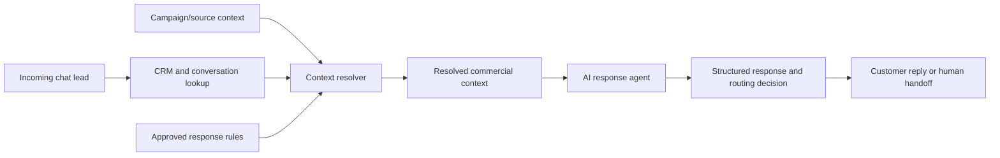

# Context-Aware AI Reception Agent for Chat Commerce

## One-liner

I designed an AI reception agent that resolves commercial context before replying, so chat-based leads receive a response aligned with the campaign, CRM stage and approved sales guidance.

## Context

A chat-driven commerce operation was receiving leads from paid campaigns, organic conversations, CRM follow-up and product inquiries. The business already had useful context, but it was spread across ads, CRM fields, conversation history and internal playbooks.

The first automated reply needed to feel specific without letting the AI guess from a noisy context package.

## Problem

The main risk was not lack of information. It was too much competing information.

An AI agent could see a recent message, historical conversation, campaign data, CRM fields and multiple approved response rules. Without a deterministic context step, the model could pick the wrong clue and answer as if the lead wanted a different product, segment or buying path.

## Solution

I added a context-resolution layer before the AI response.

The system direction includes:

- reading CRM and conversation state before generation;
- prioritizing source/campaign context when available;
- using campaign attribution as confirmation, not as an uncontrolled prompt dump;
- selecting one approved commercial directive before the model is called;
- passing a smaller, structured context package to the agent;
- applying a consultative fallback when confidence is low;
- logging which context was used for the decision.

## Architecture

## Stack

- CRM and pipeline data;
- chat message history;
- campaign/source attribution;
- workflow orchestration;
- operational database layer;
- approved response/playbook repository;
- LLM-assisted response generation;
- human handoff rules.

## What This Demonstrates

- Practical AI agent design beyond a single prompt.
- Context engineering for revenue workflows.
- Guardrails for noisy business data.
- CRM, ads and messaging integration thinking.
- Ability to reduce AI ambiguity before generation.

## Results

- Lead volume handled by the context resolver: metrics to collect.
- Reduction in wrong-context replies: metrics to collect.
- Human handoff rate by risk category: metrics to collect.
- Response-time impact: metrics to collect.
- Manual review time saved: metrics to collect.

## Lessons Learned

- The agent should not receive every possible context and decide freely.
- A deterministic resolver can make the AI layer safer and easier to debug.
- Campaign/source signals are often stronger than the last short message from the customer.
- Low confidence should trigger a consultative response, not a forced category.

## Public Guardrails

- No client name, CRM IDs, lead examples or private campaign URLs.
- No real customer messages.
- No private workflow IDs or webhook paths.
- Metrics remain `metrics to collect` until validated for public use.
