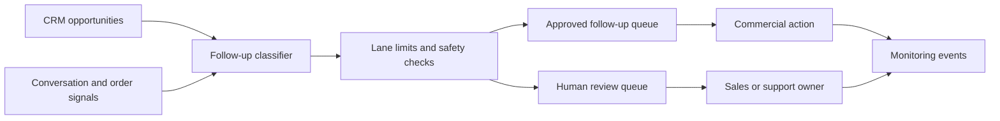

# Human-in-the-Loop Commercial Follow-up Automation

## One-liner

I designed a commercial follow-up workflow that prioritizes leads, limits automation by lane and keeps sensitive sales actions under human review.

## Context

A chat-commerce sales team had many open opportunities across CRM stages, abandoned conversations, quotes, payment situations and reactivation moments.

The business needed a follow-up layer that could recover attention without becoming a generic spam engine.

## Problem

Commercial follow-up was hard to scale because the same lead list mixed very different situations:

- recent leads waiting for a reply;
- older opportunities that needed a softer reactivation;
- quote or payment-related conversations;
- cases that should go to customer support instead of sales;
- high-risk conversations that needed a human before any message.

The workflow needed prioritization, cadence, operational limits and review queues.

## Solution

I separated follow-up automation from universal reception and designed a dedicated commercial return layer.

The system direction includes:

- classifying follow-up lanes by commercial situation;
- applying daily limits per lane;
- routing sensitive cases to human review;
- avoiding duplicate automation against reception/support workflows;
- logging follow-up events for monitoring;
- preparing operational dashboard queries;
- keeping the salesperson as the owner of final commercial action when needed.

## Architecture

## Stack

- CRM pipeline data;
- chat and conversation context;
- workflow automation;
- operational database tables;
- SQL monitoring views;
- human review queue;
- dashboard/reporting layer.

## What This Demonstrates

- Revenue operations automation with safety controls.
- Human-in-the-loop design for commercial workflows.
- Queue design, lane limits and auditability.
- Separation between reception, sales follow-up and support escalation.
- Practical monitoring design for automation reliability.

## Results

- Leads reviewed per day: metrics to collect.
- Follow-up messages approved or blocked: metrics to collect.
- Reactivated opportunities: metrics to collect.
- Manual time saved: metrics to collect.
- Duplicate automation prevented: metrics to collect.

## Lessons Learned

- Follow-up automation needs lane-level limits, not just a global on/off switch.
- Commercial automation should know when not to act.
- Review queues are part of the product, not an afterthought.
- Monitoring events matter as much as the message-generation logic.

## Public Guardrails

- No customer names, order IDs, phone numbers or sales values.
- No internal workflow IDs, URLs or database identifiers.
- No exact revenue impact until approved.
- Metrics remain `metrics to collect` until validated for public use.
