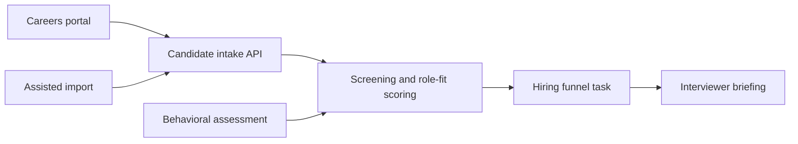

# Lightweight ATS and Candidate Intake System

## One-liner

I designed a lightweight candidate intake system that combines a careers portal, role-specific screening, assisted imports and structured handoff into an operational hiring funnel.

## Context

An operations-heavy business needed to move hiring away from scattered messages and manual resume handling.

The hiring process needed to support public applications, assisted imports from job boards, role-specific screening and a practical handoff for interviewers.

## Problem

The hiring workflow had several operational gaps:

- applications could arrive through different channels;
- resumes and screening answers were not normalized;
- behavioral or role-fit signals were hard to compare;
- candidates needed to move into a real operating funnel;
- recruiters and managers needed concise context before interviews.

## Solution

I designed a lightweight ATS layer around the existing operational surfaces.

The system direction includes:

- a careers portal for public applications;
- structured candidate intake through an API endpoint;
- assisted JSON import for candidates sourced from external job boards;
- role-specific screening criteria;
- optional behavioral score ingestion;
- handoff into an operational task/funnel system;
- interviewer-ready summaries and question prompts.

## Architecture

## Stack

- Careers portal frontend;
- candidate intake API;
- structured JSON import path;
- role-specific screening rules;
- behavioral assessment scoring;
- task/funnel management layer;
- interviewer briefing package.

## What This Demonstrates

- Operational product thinking for internal HR workflows.
- API-backed intake instead of inbox-driven hiring.
- Role-specific screening design.
- Human-in-the-loop candidate evaluation.
- Ability to turn messy operational work into a repeatable system.

## Results

- Applications processed through structured intake: metrics to collect.
- Candidates imported from external job boards: metrics to collect.
- Interview prep time saved: metrics to collect.
- Screening consistency improvement: metrics to collect.
- Hiring funnel completion rate: metrics to collect.

## Lessons Learned

- Lightweight ATS work should start with intake normalization and handoff clarity.
- Screening needs to be specific to the role, not only resume parsing.
- Assisted import is useful when public portals and job boards coexist.
- Human review stays central when decisions affect people.

## Public Guardrails

- No candidate names, resumes, contact data or assessment results.
- No private task/list IDs or workspace URLs.
- No salary or contract details unless approved.
- Metrics remain `metrics to collect` until validated for public use.
