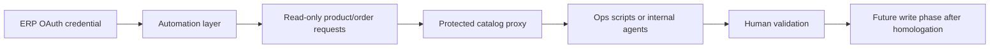

# Marketplace ERP Read-Only Integration and Catalog Proxy

## One-liner

I prepared a read-first marketplace ERP integration that exposes catalog and order visibility through a controlled proxy before allowing any write automation.

## Context

A commerce operation needed better access to product, catalog and marketplace order data for operational validation and future automation.

The account contained business-critical data, so the integration needed to start with safe read-only access, clear credential boundaries and a path to controlled expansion.

## Problem

Directly connecting local scripts or agents to the ERP API would create avoidable risk:

- credentials could leak into local files;
- write permissions could be granted too early;
- agents could change products, prices or stock before homologation;
- operational users would not have a clear test path;
- future automation would be hard to audit.

## Solution

I designed a read-first integration package.

The system direction includes:

- using OAuth credentials inside the automation layer, not in the public repo;
- starting with account, product and order read permissions;
- exposing catalog lookup through a protected proxy;
- validating unauthenticated requests fail before authenticated requests pass;
- keeping product creation, stock updates and price edits blocked until homologation;
- documenting the permission phases and rollback expectations.

## Architecture

## Stack

- Marketplace ERP API;
- OAuth2 Authorization Code flow;
- workflow automation layer;
- protected internal proxy;
- local smoke-test script;
- environment-based proxy key;
- read-first permission model.

## What This Demonstrates

- API integration with credential hygiene.
- Read-before-write automation strategy.
- Operational proxy design for agents and scripts.
- Permission phasing and homologation discipline.
- Practical commerce systems thinking.

## Results

- Products available through proxy: metrics to collect.
- Smoke-test pass rate: metrics to collect.
- Manual catalog validation time saved: metrics to collect.
- Write operations prevented before homologation: metrics to collect.

## Lessons Learned

- The first version of an ERP integration should prove safe access, not maximum automation.
- OAuth credentials belong in the orchestration layer or a vault, not in case-study files.
- A protected proxy can give agents useful context without exposing raw credentials.
- Write automation needs explicit approval, rollback and audit paths.

## Public Guardrails

- No vendor account name, client name or credential values.
- No private callback URL or proxy endpoint.
- No product IDs, order IDs or customer data.
- Metrics remain `metrics to collect` until validated for public use.
