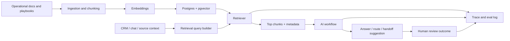

# Operational Knowledge Retrieval Layer

## One-liner

I am designing a small RAG layer that retrieves approved operational knowledge before an AI workflow answers, prioritizes or routes a commercial conversation.

## Context

The business already has useful knowledge: sales playbooks, product notes, campaign context, approved answers, CRM fields, handoff rules and historical decisions.

The problem is that this context lives across documents, workflows, databases and human memory. A generic long prompt can include too much, too little or the wrong information.

## Problem

AI workflows need context, but uncontrolled context creates operational risk:

- the model may answer from stale or irrelevant notes;
- source/campaign metadata can conflict with the latest message;
- approved answers and escalation rules can be buried inside large documents;
- teams cannot easily see which source influenced an AI decision;
- quality cannot improve without retrieval and answer evaluation.

## Solution

Build a retrieval layer that turns operational knowledge into versioned chunks with metadata, retrieves only the most relevant context for each decision and logs the retrieval path for review.

Prototype artifacts:

- [prototype/schema.sql](prototype/schema.sql)
- [prototype/sample-documents.jsonl](prototype/sample-documents.jsonl)
- [prototype/golden-questions.jsonl](prototype/golden-questions.jsonl)

The first version should stay narrow:

- approved response rules;
- product/service notes;
- handoff and escalation criteria;
- campaign/source guidance;
- commercial playbooks.

## Public Prototype Scope

This public version includes a small starter kit instead of a full private implementation:

- a Postgres + pgvector schema for documents, chunks and trace logs;
- synthetic operational documents with allowed-use metadata;
- golden questions to check retrieval and no-answer behavior;
- a trace contract that makes review and evaluation visible.

That is enough to demonstrate the architecture and evaluation mindset without exposing internal documents, workflow IDs or customer data.

## Architecture



## Retrieval Contract

Each retrieved chunk should include:

- source document;
- section heading;
- version or updated date;
- business domain;
- allowed use case;
- confidence or similarity score;
- whether it can be used for customer-facing language;
- whether it requires human approval.

## Suggested Schema

```sql
create table knowledge_documents (
  id bigserial primary key,
  source_name text not null,
  source_type text not null,
  business_domain text not null,
  public_safe boolean not null default false,
  updated_at timestamptz not null default now()
);

create table knowledge_chunks (
  id bigserial primary key,
  document_id bigint not null references knowledge_documents(id),
  heading text,
  chunk_text text not null,
  allowed_use text not null,
  requires_human_approval boolean not null default false,
  embedding vector,
  created_at timestamptz not null default now()
);

create table ai_decision_traces (
  id bigserial primary key,
  workflow_name text not null,
  input_type text not null,
  retrieved_chunk_ids bigint[] not null default '{}',
  model_name text,
  estimated_cost_usd numeric,
  decision text,
  handoff_reason text,
  human_review_outcome text,
  created_at timestamptz not null default now()
);
```

## Eval Checklist

Retrieval quality:

- Does the expected source appear in the top results?
- Is the retrieved chunk current enough for the decision?
- Does the chunk match the correct business domain?
- Does the system return no-answer when the source is missing?

Answer quality:

- Is the answer grounded in retrieved context?
- Does it avoid unsupported claims?
- Does it preserve approved commercial language?
- Does it route sensitive cases to human review?

Cost and observability:

- Log prompt tokens, completion tokens and estimated cost.
- Log retrieved chunk IDs.
- Log final decision and handoff reason.
- Log human review outcome.

## Stack

- Postgres + pgvector for the first retrieval layer;
- n8n or scripts for ingestion and workflow orchestration;
- embeddings model for operational chunks;
- optional reranking once a baseline exists;
- Langfuse or Phoenix for tracing, evals and review workflows;
- dashboard/reporting layer for quality and cost review.

## What This Demonstrates

- RAG applied to an actual business workflow.
- Metadata-aware retrieval, not only semantic search.
- Evaluation mindset around answers, citations and no-answer behavior.
- Observability for AI-assisted decisions.
- Practical architecture vocabulary used in AI Solutions / RevOps / Implementation work.

## Results

- Documents indexed: metrics to collect.
- Golden questions passing: metrics to collect.
- Retrieval precision on approved answers: metrics to collect.
- Wrong-context replies reduced: metrics to collect.
- Average cost per AI-assisted decision: metrics to collect.
- Human review outcomes captured: metrics to collect.

## Lessons Learned

- Retrieval quality matters more than adding more raw prompt context.
- Allowed-use metadata is part of the safety design, not optional decoration.
- A no-answer or handoff path is a product feature, not a failure mode.
- Observability should log retrieval, decision and human review in the same trace.

## Public Guardrails

- No private documents or full playbooks.
- No customer messages, phone numbers, CRM IDs or internal URLs.
- Use synthetic or heavily anonymized examples only.
- Keep unvalidated numbers as `metrics to collect`.
