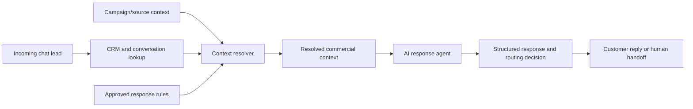

Most AI sales agents fail before the model writes a single word.

The failure is not always the prompt. It is usually the context.

In a real chat-commerce workflow, a lead can arrive with several competing signals:

- the latest customer message;
- CRM stage and owner;
- previous conversation history;
- campaign or source data;
- product/category assumptions;
- approved response rules;
- handoff and support policies.

If all of that gets dumped into a prompt, the model may produce a fluent answer based on the wrong clue.

That is not an AI problem in the abstract. It is an operating-system problem.

## The Problem

I was designing an AI reception agent for a chat-driven commerce operation.

The goal was simple: help the business reply faster and more consistently without losing the commercial context behind each lead.

But the first automated reply had a hidden risk.

A customer might send a short message like "hi" or "I want more information." On its own, that message is weak. The stronger signal may be the campaign, source, CRM stage, product page, previous conversation or approved sales rule.

If the AI agent receives all possible context at once, it still has to decide what matters.

That decision should not be left entirely to generation.

## The Design Choice

I added a context-resolution step before the AI response.

Instead of asking the model to inspect every clue and improvise, the workflow first resolves a smaller object:

```json
{
  "source_priority": "campaign_or_crm_or_message_or_fallback",
  "category": "resolved_commercial_category",
  "confidence": "high_or_medium_or_low",
  "selected_directive": "one_approved_response_rule"
}
```

The important part is not the exact schema. It is the order of decisions.

The system first decides which commercial context is most trustworthy. Only then does the AI agent write the reply.

## The Architecture



The resolver is intentionally boring.

It is a control layer, not a creativity layer.

It exists to answer questions like:

- What is the lead probably asking about?
- Which source should win when signals conflict?
- Is confidence high enough to answer directly?
- Which approved sales rule should be used?
- Should the system reply, ask a clarifying question or hand off to a human?

## Why This Matters

In business workflows, "more context" is not always better.

More context can mean more ambiguity:

- old messages compete with new ones;
- generic playbooks compete with campaign-specific offers;
- product assumptions compete with what the customer actually asked;
- internal rules compete with customer-facing language.

The context resolver reduces that ambiguity before the model responds.

The AI layer becomes easier to debug because every reply can be traced back to a chosen context, confidence level and directive.

## Guardrails

The workflow keeps several guardrails around the AI response:

- low confidence triggers a consultative fallback;
- sensitive commercial cases can be routed to human review;
- approved response rules are selected before generation;
- the agent receives a compact context package instead of a noisy dump;
- the system logs what context was used.

This is not about making the AI sound more impressive.

It is about making the operational decision safer.

## What I Would Measure Next

The current public version keeps metrics as `metrics to collect`, because I do not want to publish numbers that are not validated.

The useful metrics would be:

- lead volume handled by the context resolver;
- reduction in wrong-context replies;
- human handoff rate by risk category;
- response-time impact;
- manual review time saved.

## The Lesson

For AI agents in revenue workflows, the prompt is only one part of the system.

The harder design question is:

> What should the model be allowed to know, trust and act on?

That is why I prefer designing AI agents as operating workflows: context resolution, retrieval, guardrails, structured outputs, human review and observability.

The public case study is here:

<https://github.com/rkrisa/portfolio-ai-ops/tree/main/cases/context-aware-ai-reception-agent>

